# Multi-Regional AKS Deployment with Terraform

This repository contains a reference implementation for deploying a Java-based application on Azure Kubernetes Service (AKS) across multiple regions. The architecture is designed for high availability and isolation, with independent regional deployments sharing specific global services.

## Quick Start

```bash
# 1. Log into Azure
az login

# 2. Set your subscription
export ARM_SUBSCRIPTION_ID="your-subscription-id"

# 3. Bootstrap the shared state backend (once per subscription)
./scripts/stamp bootstrap

# 4. Deploy a stamp
./scripts/stamp deploy swc-dev

# Or do everything in one command:
./scripts/stamp deploy-all swc-dev

# Deploy just few layers:
./scripts/stamp deploy swc-dev --layers networking,compute
```

## Architecture Overview

The infrastructure is provisioned using a **layered Terraform** approach, ensuring modularity and independent lifecycle management.

```mermaid
flowchart TB
    subgraph Bootstrap["00-Bootstrap"]
        TFState[(Terraform State<br/>Storage Account)]
    end

    subgraph Stamp1["Stamp: swc-dev (Sweden Central)"]
        subgraph Net1["01-Networking"]
            VNet1[VNet 10.10.0.0/16]
            AKSSub1[AKS Subnet /22]
            PESub1[PE Subnet /24]
        end
        
        subgraph Shared1["02-Shared"]
            SB1[Service Bus 🔒]
            Storage1[Storage 🔒]
            DNS1[Private DNS Zones]
        end
        
        subgraph Compute1["04-Compute"]
            AKS1[AKS Cluster]
            ACR1[ACR 🔒]
            KV1[Key Vault 🔒]
        end
    end

    subgraph Stamp2["Stamp: neu-prod (North Europe)"]
        subgraph Net2["01-Networking"]
            VNet2[VNet 10.20.0.0/16]
            AKSSub2[AKS Subnet /22]
            PESub2[PE Subnet /24]
        end
        
        subgraph Shared2["02-Shared"]
            SB2[Service Bus 🔒]
            Storage2[Storage 🔒]
            DNS2[Private DNS Zones]
        end
        
        subgraph Compute2["04-Compute"]
            AKS2[AKS Cluster]
            ACR2[ACR 🔒]
            KV2[Key Vault 🔒]
        end
    end

    subgraph Database["03-Database"]
        Mongo[(MongoDB Atlas)]
    end

    TFState -.-> Stamp1 & Stamp2
    
    VNet1 --> AKSSub1 & PESub1
    VNet2 --> AKSSub2 & PESub2
    
    AKS1 --> ACR1
    AKS2 --> ACR2
    
    AKS1 & AKS2 --> Mongo
```



### Layer Dependency Flow


### Private Networking Architecture


Every deployment is scoped to a single **stamp**, which is defined by a `stamp_id` (used to derive names, CIDRs, and regions) and a `subscription_id`. The catalog of supported stamps lives in `terraform/modules/stamp/main.tf`; add new entries there to unlock more regions without changing any layer inputs. Globally unique resources (Storage Accounts, ACR) automatically append a deterministic hash of `stamp_id + subscription_id` so the same stamp can exist in multiple subscriptions without name collisions.

**Shared Bootstrap**: All stamps share a single Terraform state backend. Run `./scripts/stamp bootstrap` once per subscription to create the shared state storage. All subsequent stamp deployments use this shared backend.

> Stamp IDs must use only letters, numbers, and dashes (e.g., `swc-dev`, `neu-prod`). Other characters will be stripped, which can lead to invalid Azure resource names.

You can also control whether a stamp expects the `02-shared` layer by setting `shared = { enabled = false }` within the catalog entry. When disabled, the compute layer skips the shared remote-state lookup and associated role assignments, letting you deploy compute-only stamps without provisioning shared services.

### Key Features
*   **Multi-Region Support**: Independent deployments in two or more Azure regions.
*   **Environment-Aware Stamps**: Each stamp includes an `environment` attribute (dev/staging/prod) for proper sizing and tagging.
*   **Stamp-Based Independence**: Each region is deployed as an isolated stamp driven by a `stamp_id`.
*   **Private Networking**: All services are secured behind Private Endpoints with proper DNS resolution via Private DNS Zones.
*   **Shared Services**: Each stamp hosts its own shared resources (Storage, Service Bus) with Private Endpoints.
*   **Database**: MongoDB Atlas integration with secure connectivity.
*   **Security**: Comprehensive usage of Managed Identities and RBAC for all service interactions.
*   **Zone Redundancy**: AKS clusters are deployed with Availability Zone support.
*   **Java-Optimized**: Memory-optimized VM sizes, larger subnets (/22), and workload identity enabled for JVM workloads.

### Infrastructure Layers

The Terraform configuration is split into five distinct layers, each with its own state file:

1.  **`00-bootstrap`**: Creates the shared Terraform state backend (Storage Account with Azure AD auth).
2.  **`01-networking`**: Provisions Virtual Networks, Subnets (/22 for AKS), and Network Security Groups.
3.  **`02-shared`**: Deploys shared resources (Azure Service Bus, Storage Account) with Private Endpoints and DNS Zones.
4.  **`03-database`**: Manages MongoDB Atlas clusters and database users.
5.  **`04-compute`**: Deploys the application runtime (AKS, ACR Premium with PE, Key Vault) and configures Identity/RBAC.
6.  **`05-monitoring`**: Deploys Application Insights availability tests and alerts for endpoint monitoring.

---

## Stamp CLI

The `./scripts/stamp` command provides a unified interface for managing stamps:

```bash
# List available stamps
./scripts/stamp list

# Bootstrap shared state backend (once per subscription)
./scripts/stamp bootstrap

# Deploy a stamp (default: networking, shared, compute)
./scripts/stamp deploy swc-dev

# Full deployment (bootstrap if needed + deploy)
./scripts/stamp deploy-all swc-dev

# Plan changes without applying
./scripts/stamp plan swc-dev

# Check deployment status
./scripts/stamp status swc-dev

# Get AKS credentials
./scripts/stamp credentials swc-dev
./scripts/stamp creds swc-dev --admin

# Destroy a stamp
./scripts/stamp destroy swc-dev

# Validate all Terraform
./scripts/stamp validate

# Format Terraform files
./scripts/stamp fmt
```

### Layer Selection

By default, `deploy` runs layers: **networking**, **shared**, **compute** (database is skipped).

Use `--layers` or `--skip` to customize which layers to deploy:

```bash
# Deploy only networking and compute (skip shared)
./scripts/stamp deploy swc-dev --layers networking,compute

# Deploy default layers except shared
./scripts/stamp deploy swc-dev --skip shared

# Deploy only compute (useful for AKS updates)
./scripts/stamp deploy swc-dev -l compute

# Include database layer explicitly
./scripts/stamp deploy swc-dev --layers networking,shared,database,compute
```

**Layer shortcuts:**

| Layer | Aliases |
|-------|---------|
| `01-networking` | `networking`, `net`, `01` |
| `02-shared` | `shared`, `02` |
| `03-database` | `database`, `db`, `03` |
| `04-compute` | `compute`, `04` |
| `05-monitoring` | `monitoring`, `mon`, `05` |

### Using Make Shortcuts

For convenience, a `Makefile` is provided:

```bash
make list              # List stamps
make bootstrap         # Bootstrap state backend
make deploy STAMP=swc-dev  # Deploy a stamp
make destroy STAMP=swc-dev # Destroy a stamp
make fmt               # Format Terraform
make validate          # Validate Terraform
```

---

## Stamp Catalog

The stamp catalog in `terraform/modules/stamp/main.tf` defines all available deployment targets:

| Stamp ID | Region | Environment | AKS VM Size | Node Count | Address Space |
|----------|--------|-------------|-------------|------------|---------------|
| `swc-dev` | Sweden Central | dev | Standard_E4s_v5 | 2 | 10.10.0.0/16 |
| `swc-staging` | Sweden Central | staging | Standard_E4s_v5 | 3 | 10.11.0.0/16 |
| `swc-prod` | Sweden Central | prod | Standard_E8s_v5 | 3 | 10.12.0.0/16 |
| `neu-dev` | North Europe | dev | Standard_E4s_v5 | 2 | 10.20.0.0/16 |
| `neu-prod` | North Europe | prod | Standard_E8s_v5 | 3 | 10.21.0.0/16 |

### Adding a New Stamp

To add a new region or environment, add an entry to the `default_catalog` in `terraform/modules/stamp/main.tf`:

```hcl
weu-prod = {
  location               = "westeurope"
  environment            = "prod"
  address_space          = "10.30.0.0/16"
  aks_subnet_cidr        = "10.30.0.0/22"   # /22 = 1022 IPs for Java workloads
  pe_subnet_cidr         = "10.30.4.0/24"
  service_cidr           = "10.30.10.0/24"
  dns_service_ip         = "10.30.10.10"
  service_bus_capacity   = 4
  service_bus_partitions = 4
  aks_vm_size            = "Standard_E8s_v5"  # Memory-optimized for JVM
  aks_node_count         = 3
  aks_max_pods           = 30
  shared = {
    enabled = true
  }
}
```

Then deploy: `./scripts/stamp deploy weu-prod`

---

## Prerequisites

*   **Terraform**: v1.3+
*   **Azure CLI**: v2.40+
*   **MongoDB Atlas Account**: API Keys (Public/Private) and Organization ID.
*   **Azure Subscription(s)**: Access to one or more subscriptions for multi-region deployment.

---

## Deployment Guide

### Option 1: Stamp CLI (Recommended)

```bash
# Set environment (or create .env file)
export ARM_SUBSCRIPTION_ID="your-subscription-id"

# One-time: Create shared state backend
./scripts/stamp bootstrap

# Deploy dev environment
./scripts/stamp deploy swc-dev

# Deploy production in another region
./scripts/stamp deploy neu-prod
```

### Option 2: Manual Layer-by-Layer

#### 1. Bootstrap State Backend
Deploy the shared remote backend:

```bash
terraform -chdir=terraform/layers/00-bootstrap init
terraform -chdir=terraform/layers/00-bootstrap apply \
  -var="subscription_id=<SUBSCRIPTION_ID>" \
  -var="stamp_id=_bootstrap"
```

The module creates:
* `rg-bootstrap-tfstate`
* `st<hash>tfstate`
* `tfstate` container with Azure AD auth only

#### 2. Initialize Higher Layers
All higher layers look up the backend coordinates from the bootstrap outputs:

```bash
./scripts/init-layer.sh 01-networking
./scripts/init-layer.sh 02-shared
./scripts/init-layer.sh 03-database
./scripts/init-layer.sh 04-compute
./scripts/init-layer.sh 05-monitoring
```

#### 3. Deploy Layers
Deploy the layers in numerical order:

```bash
# Layer 1: Networking (VNet with /22 AKS subnet)
./scripts/apply-layer.sh 01-networking \
  -var="subscription_id=<SUBSCRIPTION_ID>" \
  -var="stamp_id=swc-dev"

# Layer 2: Shared Resources (Storage + Service Bus with Private Endpoints & DNS Zones)
./scripts/apply-layer.sh 02-shared \
  -var="subscription_id=<SUBSCRIPTION_ID>" \
  -var="stamp_id=swc-dev"

# Layer 3: Database (MongoDB Atlas - requires additional credentials)
./scripts/apply-layer.sh 03-database \
  -var="subscription_id=<SUBSCRIPTION_ID>" \
  -var="stamp_id=swc-dev"

# Layer 4: Compute (AKS + ACR Premium with PE + Key Vault)
./scripts/apply-layer.sh 04-compute \
  -var="subscription_id=<SUBSCRIPTION_ID>" \
  -var="stamp_id=swc-dev"
```


#### 4. Clone to Another Environment
To deploy the same architecture to staging or production:

```bash
# Switch to staging
./scripts/stamp deploy swc-staging

# Or deploy to a different region
./scripts/stamp deploy neu-prod
```

---

## Architecture Details

### Private Networking

All services use Private Endpoints with automatic DNS resolution:

| Service | Private DNS Zone |
|---------|------------------|
| Azure Blob Storage | `privatelink.blob.core.windows.net` |
| Azure Service Bus | `privatelink.servicebus.windows.net` |
| Azure Container Registry | `privatelink.azurecr.io` |
| Azure Key Vault | `privatelink.vaultcore.azure.net` |

### Java/JVM Optimizations

The infrastructure is specifically tuned for Java workloads:

| Setting | Value | Rationale |
|---------|-------|-----------|
| AKS Subnet Size | /22 (1022 IPs) | Azure CNI requires ~1 IP per pod; Java apps typically run fewer, larger pods |
| VM Size | Standard_E4s_v5/E8s_v5 | Memory-optimized for JVM heap requirements |
| Max Pods per Node | 30 | Conservative limit for larger Java containers |
| OS Disk Size | 128 GB | Sufficient for container images and logs |
| Workload Identity | Enabled | OIDC-based auth for Azure SDK (no secrets in pods) |

### Tagging Strategy

All resources are automatically tagged:

```hcl
{
  stamp_id    = "swc-dev"
  environment = "dev"
  managed_by  = "terraform"
}
```

---

## Directory Structure

```
terraform/
├── layers/
│   ├── 00-bootstrap/   # Shared state backend setup
│   ├── 01-networking/  # VNets, Subnets (/22), NSGs
│   ├── 02-shared/      # Service Bus, Storage, Private DNS Zones
│   ├── 03-database/    # MongoDB Atlas
│   ├── 04-compute/     # AKS, ACR Premium, Key Vault, Private Endpoints
│   └── 05-monitoring/  # Application Insights, availability tests, alerts
└── modules/
    ├── stamp/          # Stamp catalog and naming conventions
    ├── networking/     # Reusable networking logic
    └── compute/        # Reusable compute logic (Java-optimized AKS)
apps/
├── README.md           # Application deployment documentation
└── petclinic/          # Spring PetClinic Helm chart
    ├── Chart.yaml
    ├── values.yaml     # Default values
    ├── values-dev.yaml # Dev environment overrides
    ├── values-staging.yaml
    ├── values-prod.yaml
    └── templates/      # Kubernetes manifests
scripts/
├── stamp               # Unified CLI for stamp management
├── deploy-app.sh       # Deploy applications to AKS
├── init-layer.sh       # Initialize layer with backend config
├── apply-layer.sh      # Apply a layer
└── destroy-layer.sh    # Destroy a layer
pipelines/
├── bootstrap.yml       # Create shared state backend
├── deploy-stamp.yml    # Deploy infrastructure
├── deploy-app.yml      # Deploy applications to AKS
├── destroy-stamp.yml   # Destroy infrastructure
└── pr-validation.yml   # Validate on PRs
Makefile                # Convenience shortcuts
.env.example            # Environment template
```

---

## Destroying Infrastructure

Using the stamp CLI:

```bash
./scripts/stamp destroy swc-dev
```

Or manually in reverse order:

```bash
./scripts/destroy-layer.sh 04-compute -var="stamp_id=swc-dev" -var="subscription_id=<SUB_ID>"
./scripts/destroy-layer.sh 03-database -var="stamp_id=swc-dev" -var="subscription_id=<SUB_ID>"
./scripts/destroy-layer.sh 02-shared -var="stamp_id=swc-dev" -var="subscription_id=<SUB_ID>"
./scripts/destroy-layer.sh 01-networking -var="stamp_id=swc-dev" -var="subscription_id=<SUB_ID>"
```

> ⚠️ The `00-bootstrap` layer (shared state backend) is NOT destroyed when you destroy a stamp. It contains `prevent_destroy = true` on state storage. Destroy it manually if needed.

---

## Azure DevOps Pipelines

For CI/CD automation, Azure DevOps pipelines are provided in the `pipelines/` directory:

| Pipeline | Description |
|----------|-------------|
| `bootstrap.yml` | Create shared Terraform state backend (run once) |
| `deploy-stamp.yml` | Deploy a stamp with layer selection |
| `pr-validation.yml` | Validate Terraform on pull requests |
| `destroy-stamp.yml` | Destroy a stamp (with confirmation) |

See [pipelines/README.md](pipelines/README.md) for complete setup instructions.

### Quick Setup

1. Create service connections with Contributor + Storage Blob Data Contributor roles
2. Create variable group `stamp-common` with `SUBSCRIPTION_ID`
3. Create environments: `dev`, `staging`, `prod`, `destroy-approval`
4. Import pipelines from the `pipelines/` directory
5. Run bootstrap pipeline once
6. Use deploy-stamp pipeline for deployments

---

## Application Deployment

Once infrastructure is deployed, you can deploy applications to AKS clusters using Helm.

### Available Applications

| Application | Description |
|-------------|-------------|
| `petclinic` | Spring PetClinic - Java demo application for testing deployments |

### Using the CLI

```bash
# Deploy petclinic to swc-dev
./scripts/deploy-app.sh swc-dev petclinic

# Deploy to a specific namespace
./scripts/deploy-app.sh swc-dev petclinic petclinic deploy

# Dry run (see what would be deployed)
./scripts/deploy-app.sh swc-dev petclinic default dry-run

# Uninstall
./scripts/deploy-app.sh swc-dev petclinic default uninstall
```

### Using Azure DevOps Pipeline

Use the `deploy-app.yml` pipeline for CI/CD deployments:

1. Go to **Pipelines** → **deploy-app.yml**
2. Select the target stamp (determines which AKS cluster)
3. Choose the application to deploy
4. Specify namespace (default: `default`)
5. Choose action: `deploy`, `uninstall`, or `dry-run`
6. Run the pipeline (production stamps require approval)

### Environment-Specific Configuration

Each stamp's environment (dev/staging/prod) automatically selects the appropriate values file:

| Stamp | Environment | Values File |
|-------|-------------|-------------|
| `swc-dev` | dev | `values-dev.yaml` |
| `swc-staging` | staging | `values-staging.yaml` |
| `swc-prod` | prod | `values-prod.yaml` |
| `neu-dev` | dev | `values-dev.yaml` |
| `neu-prod` | prod | `values-prod.yaml` |

See [apps/README.md](apps/README.md) for detailed application documentation.

---

## Monitoring

The `05-monitoring` layer deploys Azure Application Insights with availability tests to monitor your endpoints.

> **Important**: Since applications are exposed via dynamic ingress IPs (no public DNS records), you must update the tfvars configuration file with the correct IP address **before** deploying the monitoring layer. First deploy your application, get the ingress IP, then update the tfvars file.

### Deploying Monitoring

```bash
# 1. First, deploy compute layer and your application
./scripts/stamp deploy swc-dev

# 2. Deploy your app (e.g., helloworld)
helm upgrade --install helloworld ./apps/helloworld -n helloworld --create-namespace

# 3. Get the ingress IP (wait 1-2 minutes for IP assignment)
kubectl get ingress -n helloworld -o jsonpath='{.items[0].status.loadBalancer.ingress[0].ip}'

# 4. Update terraform/layers/05-monitoring/swc-dev.tfvars with the IP

# 5. Deploy monitoring layer
./scripts/stamp deploy swc-dev --layers monitoring
```

### Configuring Availability Tests

Create a tfvars file to configure which endpoints to monitor. Example `terraform/layers/05-monitoring/swc-dev.tfvars`:

```hcl
alert_email_addresses = [
  "your-email@example.com"
]

availability_tests = {
  helloworld = {
    name                 = "helloworld-availability"
    url                  = "http://4.165.31.7/"  # Your ingress IP
    frequency            = 300                   # Check every 5 minutes
    timeout              = 120                   # 2 minute timeout
    expected_status_code = 200
    ssl_check_enabled    = false
    geo_locations        = ["emea-nl-ams-azr", "emea-gb-db3-azr", "emea-se-sto-edge"]
    failed_location_count = 2                    # Alert if 2+ locations fail
    alert_severity       = 1                     # Error severity
    alert_enabled        = true
  }
}
```

Then apply with the tfvars file:

```bash
cd terraform/layers/05-monitoring
terraform apply \
  -var="subscription_id=$ARM_SUBSCRIPTION_ID" \
  -var="stamp_id=swc-dev" \
  -var-file="swc-dev.tfvars"
```

### Available Geo Locations

| Location Code | Region |
|---------------|--------|
| `emea-nl-ams-azr` | Amsterdam, Netherlands |
| `emea-gb-db3-azr` | Dublin, Ireland |
| `emea-se-sto-edge` | Stockholm, Sweden |
| `emea-fr-pra-edge` | Paris, France |
| `us-va-ash-azr` | Virginia, US |
| `apac-sg-sin-azr` | Singapore |

---

## Troubleshooting

### Private Endpoint DNS Resolution
If services aren't resolving via Private Endpoints, verify the DNS Zone VNet links:
```bash
az network private-dns link vnet list -g rg-swc-dev-shared -z privatelink.blob.core.windows.net
```

### AKS IP Exhaustion
With /22 subnets, you have ~1000 IPs. Monitor usage:
```bash
az aks show -g rg-swc-dev-compute -n aks-swc-dev --query "networkProfile"
```

### ACR Pull Errors
Ensure the AKS managed identity has `AcrPull` role and the PE is healthy:
```bash
az acr private-endpoint-connection list --registry-name <acr-name>
```
